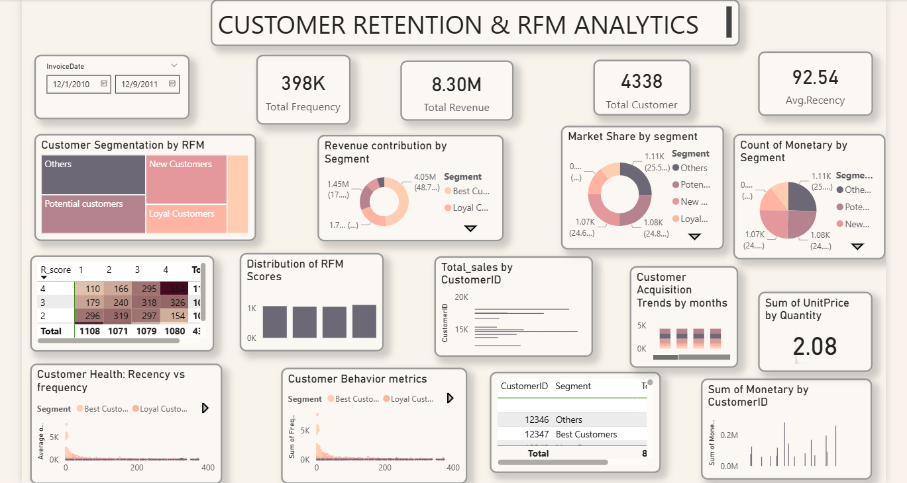

# E-commerce Customer Retention & RFM Analytics 📊

An end-to-end Data Analytics project focused on segmenting customers based on their purchasing behavior using the **RFM (Recency, Frequency, Monetary)** model. This project helps businesses identify their most loyal customers and those at risk of churning.

## 🚀 Project Overview
The goal of this project is to analyze retail sales data and categorize over **4,300 customers** into distinct segments to drive personalized marketing strategies.

## 🛠️ Tech Stack
* **Data Cleaning & Analysis:** Python (Pandas, NumPy)
* **Environment:** Google Colab 
* **Visualization:** Power BI (Interactive Dashboard)
* **Model:** RFM Analysis

## 📈 Key Insights & Features
* **Customer Segmentation:** Divided customers into segments like *Best Customers, Loyal Customers, Potential Loyalists,* and *At Risk*.
* **KPI Tracking:** Real-time tracking of Total Revenue ($8.30M), Total Customers (4,338), and Average Recency.
* **Retention Strategies:** Visualized customer acquisition trends and market share by segment to identify growth opportunities.
* **Interactive Heatmap:** Analyzed the relationship between Recency and Frequency scores.

## 🖼️ Dashboard Preview



## 📂 Project Structure
* `salesretail1.ipynb`: Python notebook containing data preprocessing and RFM calculation logic.
* `RFM_Dashboard.pbix`: Power BI file with interactive visuals.
* `Dataset`: Cleaned retail transaction data.

---
Created by **Shivangi Tiwari** ```
